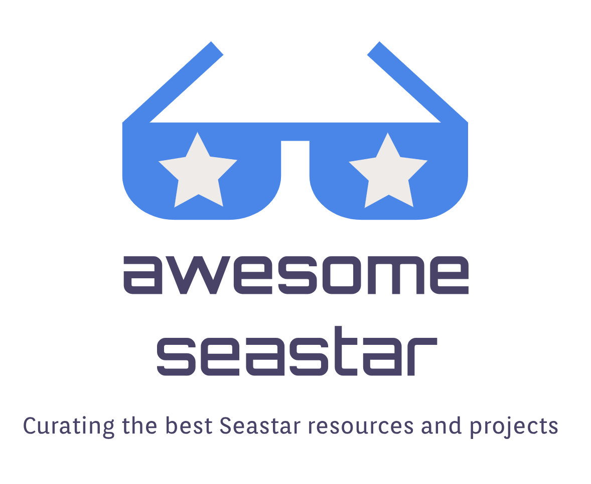

	

		
	

## Content

- [Projects](#projects)
	- [SMF RPC](#smf-rpc)
- [Resource](#resource)
	- [Official tutorial](#official-tutorial)
	- [Asynchronous Programming with Seastar](#asynchronous-programming-with-seastar)
	- [Seastar internals](#seastar-internals)
	- [Build a message-oriented middleware using seastar](#build-a-message-oriented-middleware-using-seastar)
- [Contributors](#contributors)

[Seastar](http://seastar.io/) is an open source c++ framework designed to help build highly-performant server application. It's used by [ScyllaDb](https://www.scylladb.com/), a high-performance NoSQL Database.

One of the key feature of Seastar is it's event-driven nature which makes it easy for it's user to write non-blocking, asynchronous code. Moreover, Seastar architecture is based on the following points:

- [Shared-nothing Design](http://seastar.io/shared-nothing/): Seastar uses a shared-nothing model that shards all requests onto individual cores. 

- [Futures and Promises](http://seastar.io/futures-promises/): An advanced new model for concurrent applications that offers C++ programmers both high performance and the ability to create comprehensible, testable high-quality code. 

- [High-performance networking](http://seastar.io/networking/) : Seastar offers a choice of network stack, including conventional Linux networking for ease of development, DPDK for fast user-space networking on Linux, and native networking on OSv

- [Messaging passing](http://seastar.io/message-passing/) : A design for sharing information between CPU cores without time-consuming locking.

# Projects
*Systems and projects using Seastar*

* [Ceph](https://github.com/ceph/ceph)
** https://github.com/ceph/ceph/tree/master/src/crimson
** https://www.usenix.org/conference/vault20/presentation/just
* [CPV web framework](https://github.com/cpv-project/cpv-framework)
* [CPV CQL driver](https://github.com/cpv-project/cpv-cql-driver)
* [K2](https://github.com/futurewei-cloud/chogori-platform)
* [Parquet4Seastar](https://github.com/michoecho/parquet4seastar)
* [Pedis](https://github.com/fastio/1store)
* [Redpanda](https://github.com/vectorizedio/redpanda/) drop-in replacement Apache Kafka designed for modern hardware
* [Scylladb](https://github.com/scylladb/scylla) API-compatible with Apache Cassandra and Amazon DynamoDB
* [Shredder](https://github.com/utah-scs/shredder)
* [Nanoservices](https://github.com/utah-scs/nanoservices)

## SMF RPC
[SMF](https://github.com/smfrpc/smf) is a new RPC framework built for microseconds latencies using the seastar framework.

# Resource

## Official tutorial
https://github.com/scylladb/seastar/blob/master/doc/tutorial.md

## Asynchronous Programming with Seastar
[Asynchronous Programming with Seastar](http://nadav.harel.org.il/seastar/) is a series of tutorials that covers almost all Seastar compnents along with specific ways to debug seastar programs. Another important point about this series is that it's written by two maintainers of Seastar, Nadav Har’El and Avi Kivity.

## Seastar internals
[Seastar internals](https://makedist.com/projects/seastar-internals/) is a series of deep dives into various components found in the Seastar framework such as Seastar smart pointers, temporary buffer, and the gate abstraction.

These articles are written by [Noah Watkins](https://twitter.com/dotnwat), a Principal Architect at Vectorized and the initiator of this list, who spent the last couple of years working on products using Seastar.

## Build a message-oriented middleware using seastar
[Rolling your own MOM or how I did it](https://dev.to/cppchedy/rolling-out-your-own-mom-or-how-i-did-it-general-introduction-3j20) is a series written to document the architecture and messaging model of the message-oriented middleware MOZA writting using c++17 and the framework seastar.

# Contributors

<!-- prettier-ignore-start -->
<!-- markdownlint-disable -->
<table>
  <tr>
    <td align="center"><a href="https://twitter.com/cppchedy"> <b>Chedy Najjar</b></a></td>
  </tr>
</table>
<!-- markdownlint-restore -->
<!-- prettier-ignore-end -->
